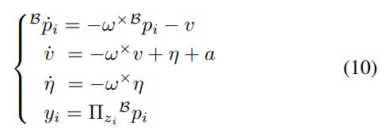

# RL-based Adaptive LTV Factor Weighting for Robust Visual-Inertial Odometry

## VINS-Fusion-LTV

LTV Observer： Pose, Velocity and Landmark Position Estimation Using IMU and Bearing Measurements





```bash
Camera bearings + IMU
        ↓
   LTV Observer
        ↓
  v_hat_B, eta_hat
        ↓
VINS-Fusion optimizer
   + gravity factor
   + velocity factor
```

最终一个窗口优化求解的是：
$$
\min_{X} \left[ \|r_{\text{prior}}\|^2 + \sum \|r_{\text{IMU}}\|^2 + \sum \|r_{\text{reproj}}\|^2 + \sum \|r_{g}\|^2 + \sum \|r_{v}\|^2 \right]
$$


## RL-based Adaptive LTV Factor Weighting

把“什么时候启用LTV”和“LTV相信多少”建模为 RL 决策，当前运动/视觉/LTV质量→{是否启用LTV,wg​,wv​}

VINS-Fusion→VINS + LTV fixed weight→RL adaptive LTV gating/weighting​