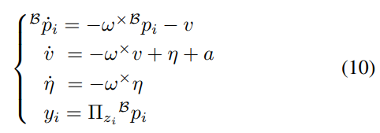

# RL-based Adaptive LTV Factor Weighting for Robust Visual-Inertial Odometry

## VINS-Fusion-LTV

LTV Observer： Pose, Velocity and Landmark Position Estimation Using IMU and Bearing Measurements





```bash
Camera bearings + IMU
        ↓
   LTV Observer
        ↓
  v_hat_B, eta_hat
        ↓
VINS-Fusion optimizer
   + gravity factor
   + velocity factor
```

最终一个窗口优化求解的是：
$$
\min_{X} \left[ \|r_{\text{prior}}\|^2 + \sum \|r_{\text{IMU}}\|^2 + \sum \|r_{\text{reproj}}\|^2 + \sum \|r_{g}\|^2 + \sum \|r_{v}\|^2 \right]
$$


## RL-based Adaptive LTV Factor Weighting

把“什么时候启用LTV”和“LTV相信多少”建模为 RL 决策，当前运动/视觉/LTV质量→{是否启用LTV,wg​,wv​}

VINS-Fusion→VINS + LTV fixed weight→RL adaptive LTV gating/weighting​
## Stage7 verified EuRoC configuration

Stage7 uses all 11 EuRoC sequences as tuning data. The selected Joint configuration
changes only the gravity gate innovation threshold from 0.05 to 0.03. The frozen
mean relative ATE objective J improves from -2.865% to -3.105%; the absolute ATE
arithmetic mean increases by 0.17% versus W0. See the [full results](docs/euroc_tuned_results.md)
and [execution protocol](docs/stage7_delivery_protocol.md), including per-sequence regressions.

After building and sourcing the workspace, launch the published configuration:

```bash
ros2 launch vins stage7.launch.py output_dir:=$HOME/output/stage7_live rviz:=true
```

Use `config:=/absolute/path/euroc_stage7.yaml` to select a complete configuration.
The launch file copies calibrations and writes the effective YAML into `output_dir`.
The six selected parameters and SHA are in `config/tuning/stage7_final_parameters.*`.
The offline replay, ROS publisher/RViz checks and node startup pass; these checks
are not measurements of live sensor throughput or real-time trajectory accuracy.
